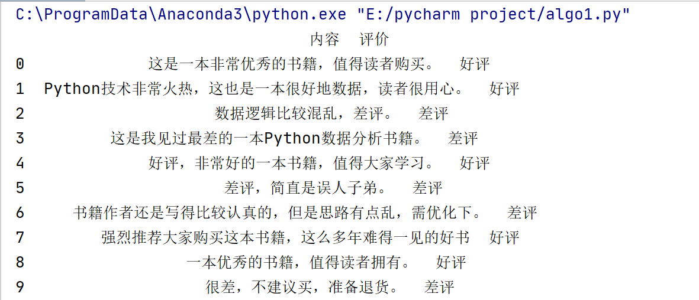

Naive Bayesian and Public Opinion Analysis

1. Knowledge of the mathematical principles of Naive Bayes

Naive Bayesian is a classification method based on Bayes' theorem and independent assumption of characteristic conditions. It calculates the probability of classification by features and selects the situation with high probability. It is a machine learning classification method (supervised learning) based on probability theory, which is widely used in the field of sentiment classification classifier.

1.1 What is a probability-based approach?

A measure of the likelihood of an event occurring by probability. Probability theory and statistics are two opposite concepts, statistics is to take part of the sample statistics to estimate the overall situation, while probability theory is to estimate the occurrence of a single event or part of the event through the overall situation. Probability theory requires known data to predict unknown events.

For example, we see cloudy weather, lightning, thunder, and gusts of wind. Under such weather characteristics (F), we infer that the probability of rain is greater than the probability of no rain, i.e. P (rain)> P (no rain), so we assume that it will rain later. This is an empirically judged probability. Through years of long-term accumulation of data, the weather bureau calculate the probability of rain today P (rain)=85%, P (no rain)=15%, the same P (rain)> P (no rain), so today's weather forecast definitely forecast rain. This is a method to calculate the probability of a rain event.

1.2 conditional probability

If Ω is complete, A and B is one of the events (subset), conditional probability represents the probability that one event occurs when another event occurs. Suppose that the probability of event A occurring after event B is:

Suppose P(A)>0，then P(AB) = P(B|A)P(A) = P(A|B)P(B).

For the event, A, B, C, if P (AB) > 0, then P (ABC) = P (A) P (B | A) P (C | AB)

If A and B are two independent events, the intersecting probability is P(A∩B) = P(A)P(B)

1.3 total probability rule

Set Ω for the sample space for trial E. A is an event of E, and Ω is dividend into B1, B2,... , Bn, and P (Bi) > 0, i = 1, 2,... , n. Then we have:

P(A) = P(AB1)+P(AB2)+...+P(ABn) = P(A|B1)P(B1)+P(A|B2)P(B2)+...+P(A|Bn)P(Bn)

The main purpose of the total probability formula is that it can decompose a complex probability calculation problem into a number of simple probability calculation problems. Finally, the final result can be obtained by applying the additivity of probability.

1.4 bayes formula

Let Ω be the sample space of experiment E, A be the event of E, if there are k mutually exclusive and finite events, that is, B1, B2, ..., Bk is a division of Ω, and P(B1)+ P(B2)+...+P(Bk)=1, P(Bi)>0 (i=1,2,...,k), then we have：

P(A)：Probability of event A occurring

P(A∩B)：The probability that event A and event B happen together

P(A|B)：The probability of event A occurring when B occurring

Now it is known that time A has indeed occurred. To estimate the probability that it is caused by cause Bi, it can be obtained by Bayes formula.

1.5 Prior probabilities and posterior probabilities

Priori probability is the probability obtained from previous data analysis. It generally refers to the probability of occurrence of a class of things, the probability determined by historical data or subjective judgment that has not been confirmed. The posterior probability is the probability of re-correcting after the information is obtained. It is the probability of a specific thing happening under a certain condition.

1.6 Naive Bayesian classification

The Bayesian classifier predicts the probability that an object belongs to a certain category, and then predicts its category, which is constructed based on Bayes' theorem. When processing large-scale data sets, Bayesian classifiers show high classification accuracy.

Suppose there are two categories：

If p1(x,y)>p2(x,y), then put into category 1

If p1(x,y)<p2(x,y), then put into category 2

Bayes' theorem:

x and y represent feature variables, ci represents classification, and p(ci|x,y) represents the probability of being classified into category ci when the features are x, y. Therefore, combining conditional probability and Bayes' theorem is:

1) If p(c1|x,y)>p(c2,|x,y), then the classification should belong to category c1
1) If p(c1|x,y)<p(c2,|x,y), then the classification should belong to category c2

The biggest advantage of Bayes' theorem is that the known probability can be used to calculate the unknown probability, and if it is only to compare the size of p(ci|x,y) and p(cj|x,y), you only need to know two probabilities, with the same denominator, just compare p(x,y|ci)p(ci) and p(x,y|cj)p(cj)

1.7 Advantages and disadvantages

\1) Supervised learning needs to determine the objectives of classification

\2) The method is not sensitive to missing data and can still be used in the case of less data

\3) Can handle the classification of multiple categories

\4) Applicable to nominal data

\5) Sensitive to the form of input data

\6) Due to the use of prior data to predict classification, errors exist

2. Simple case of naive bayes

Scikit-Learn package provides three Naive Bayesian classification algorithms:

1) Gaussian Naive Bayesian classification
1) Multinomial Naive Bayesian classification
1) Bernoulli Naive Bayesian classification

2.1 GaussianNB

Coding: sklearn.naive\_bayes.GaussianNB(priors=None)

The following six coordinate points are randomly generated. When the x and y are both positive, the corresponding class is marked as 2; when the x and y are both negative, the corresponding class is marked as 1. The code analyzed by Gauss Naive Bayesian classification is as follows:

` `The prediction result of [-0.8, -1] is class 1, that is, the x and y are both negative numbers:

2.2 MultinomialNB

Multinomial Naive Bayesian classification mainly used for discrete feature classification, such as text classification word statistics, with the number of occurrences as the feature value.The Multinomial model will do some smoothing when calculating the prior probability P(yk) and the conditional probability P(xi|yk). The specific formula is:

N is the total number of samples,

k is the total number of categories,

Nyk is the number of samples with category yk, 

α is the smoothing value

Nyk is the number of samples in the category yk, 

n is the dimension of the feature,

Nyk, xi are samples in the category yk, the value of the i-th dimension is the number of samples in xi, α is the smooth value

Coding: sklearn.naive\_bayes.MultinomialNB(alpha=1.0, fit\_prior=True, class\_prior=None)

alpha is optional, default 1.0, add Laplace/Lidstone smoothing parameter; 

fit\_prior default True, indicating whether to learn prior probabilities, parameter False indicates that all class markers have the same prior probability; 

class\_prior is similar to an array, The size of the array is (n\_classes,), the default is None.

2.3 BernoulliNB

Similar to Multinomiall Naive Bayes, it is also mainly used for discrete feature classification. The difference from MultinomialNB is: MultinomialNB takes the number of occurrences as the feature value, and BernoulliNB is a binary or Boolean feature.

Coding:sklearn.naive\_bayes.BernoulliNB(alpha=1.0,binarize=0.0,fit\_prior=True,class\_prior=None)

2. Naive Bayes on Chinese text public opinion analysis

Suppose you now want to determine if a message is spam. Here are the steps:

1) Split the data set into words, Chinese word segmentation technology
1) Calculate the total number of words in the sentence and determine the size of the word vector
1) Transform the words in the sentence into vectors
1) Calculate P(Ci), P(Ci|w)=P(w|Ci)P(Ci)/P(w), which represents the conditional probability that the sample is classified as Ci when the w feature appears
1) Determine the probabilities of P(w[i]C[0]) and P(w[i]C[1]). The higher probability of the two sets is the classification label

An example of Book evaluation information

3.1 Read the Data set 

Suppose there are 10 book order evaluation information as shown below, and each evaluation information corresponds to a result (good and bad reviews), as shown in the figure below:

Use pandas package to read the data set:

3.2 Chinese word segmentation and filtering stop words

Then use jieba to segment Chinese word, and the stop words: 

stopwords = {}.fromkeys(['，', '。', '！', '这', '我', '非常'])

3.3 Word frequency statistics

{python 一本 书籍 优化 优秀 但是 作者 值得 写得 准备 多年 大家 好书 好评 学习 差评 建议 强烈推荐 很差 思路 技术 拥有 数据 数据分析 最差 有点 比较 混乱 火热 用心 简直 认真 误人子弟 读者 购买 还是 这么 这是 这本 退货 逻辑 难得一见}

3.4 Data Analysis

` `The output result is shown below, and you can see the two predicted values are correct. That is, "一本优秀的书籍，值得读者拥有。" The predicted result is favorable (category mark 1), "很差，不建议买，准备退货。" The result is bad review (category mark 0)

But there is a problem. Because the amount of data is small and not representative, and the real analysis will use massive data for public opinion analysis, the prediction results are definitely not 100% correct, but the experimental results need to be as good as possible. Finally, add a piece of code for dimensionality reduction to draw graphics, as follows:

The output result is shown in the figure, the predicted result and the real result are the same, namely [1,1,0,0,1,0,0,1,1,0]

2. The large scale Public Opinion Analysis

The code given in this project showed how to deal with a large amount of public opinions and give the scores of positive/negative information. We can take these scores into our stock price prediction model in order to judge if the model is impact by public opinions. The code is shown in this package.

